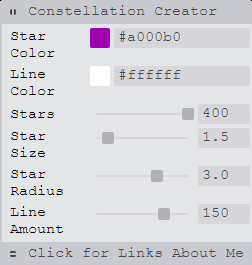

# constellation-creator :star:
Visit https://constellation-creator.github.io/ to see it in Action!


## Houdini
Made with Houdini, a set of low-level APIs that exposes parts of the CSS engine, giving the power to extend CSS by hooking into the styling and layout process of a browser’s rendering engine. 

A feature of CSS Houdini is the Worklet. With worklets, you can create modular CSS, requiring a single line of JavaScript to import configureable components: no pre-processors, post-processors or JavaScript frameworks needed.
```CSS
<script>
  CSS.paintWorklet.addModule('csscomponent.js');
</script>
```

## Tweakpane
Utilizes a compact pane library for fine-tuning parameters and monitoring value changes.

1. Integreate Tweakpane
```HTML
<script src="https://cdn.jsdelivr.net/npm/tweakpane@1.5.7/dist/tweakpane.min.js"></script>
```

2. Create a pane
```HTML
const pane = new Tweakpane();
```
3. Create Parameters 
```HTML
// Parameter object
const PARAMS = {
  speed: 0.5,
};

// Pass the object and its key to pane
const pane = new Tweakpane();
pane.addInput(PARAMS, 'speed');
```


